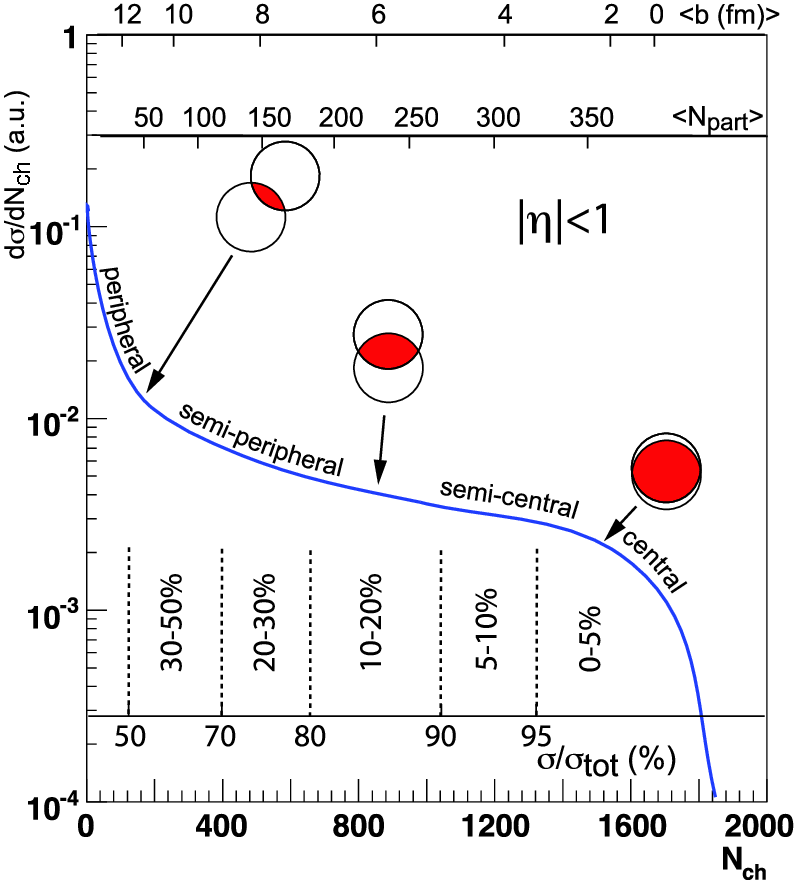

# Table of contents

- [Overview](#overview)
- [Required packages](#required_packages)
- [Task guide](#task_guide)
- [Sources](#sources)

# Overview

This is a simple projects that helps students in particle physics to study hadron production at high energy and to learn high energy physics software. The goal is for the students to perform measurements of invariant $p_T$ spectra and nuclear modification factors in various collision systems.

# Required packages

[Installation tutorial](../INSTALLATION_TUTORIAL.md) contains installation instruction for the following packages.

- [ROOT6](https://root.cern/)
- [LHAPDF6](https://lhapdf.hepforge.org/)
- [PYTHIA8](https://pythia.org/) compiled with LHAPDF6

ROOT6, LHAPDF6, and PYTHIA8 have to be compiled with python3 for the python interface.

# Task guide

Your task is to calculate invariant $p_T$ spectra $1/(2\pi p_T) d^2 \sigma / dpT dy$ in $p+p$, $p$+A, and A+B (where A, B - generalized notation for nuclei) and nuclear modification factors $R_{pA}$, $R_{AB}$, $R_{CP}$. The output of your task must be the following:

1. $1/(2\pi p_T) d^2 \sigma / dpT dy$ for different centralities on the same picture (for each collision system)
2. $R_{AB}$ for different collision systems (for each centrality)
3. $R_{CP}$ for different collision systems

Assignment options

There are 6 assignment options for the particle species (see [1](#sources) to find MC id of particles, [2](#sources) for particle listings):

1. $\pi^\pm$ 
2. $\pi^0$ 
3. $K^\pm$
4. $(p+\bar{p})/2$
5. $\varphi(1020)$
6. $\Lambda(1115)$
7. $D^0$
8. $B^0$
9. $J/\psi(1S)$

3 assignment options for collision systems:

1. $p+p$ , $p$+Pb, Pb+Pb, $\sqrt{s_{NN}} = 5.02$ TeV, $\left| \eta \right| < 1$ (LHC). Use NNPDF40_lo_as_01180 for protons, nCTEQ15WZ_208_82 for Pb.
2. $p+p$, $p$+Au, and $Au+Au$ (both , $\sqrt{s_{NN}} = 200$ GeV, $\left| \eta \right| < 0.5$ (RHIC). Use CT18LO for protons, nCTEQ15WZ_FullNuc_197_79 for Au.

If your task number is 21 then your option is measurements of $pi^0$ in $p+p$, $p$+Pb, and Pb+Pb at $\sqrt{s_{NN}} = 5.02$ TeV

Divide $p+A$ events into $0-20\%$, $20-40\%$, $40-C_{max}\%$ centrality classes (where $C_{max}$ - maximum centrality value for the given collision system), and $A+A$ into $0-10\%$, $10-20\%$, $20-40\%$, $40-60\%$, $60-C_{max}\%$. Use the following sources for $C_{max}$ and $N_{coll}$:
 - [4](#sources) for p+Au@200
 - [5](#sources) for Au+Au@200

## How to determine centrality in pythia

There are many ways to determine centrality in Glauber model [3](#sources). In this work we use one of the simplest cases: centrality is determined by measuring charged particle multiplicity in pseudorapidity regions: $3.0 < \left| \eta \right| < 3.9$ (PHENIX) for RHIC, $2.8 < \left| \eta \right| < 5.1$ (ALICE) for LHC. This can be achieved using the following algorithm:

1. Create 1-D histogram representing the multiplicity of charged particles and start pythia event generation
2. For each event fill this histogram with the number of charged particles that are in the needed pseudorapidity region
3. After obtaining enough statistics by running pythia, divide the histograms into part representing the amount of statistics from the whole histogram from higher to lower, i.e. for $0-10\% 10% of the data, for $10-20\%$ next 10% of the data, etc. (See Fig.1)

How to determine the in which centrality particle was born

You can create a 2-D histogram for storing the needed particle $p_T$, and $N_{ch}$ of the event. After determining which $N_{ch}$ intervals lie within every centrality class, you can use these $N_{ch}$ to map the $N_{ch}$ to the centrality class of the event.

# Sources

1. [Monte Carlo numbering scheme](https://pdg.lbl.gov/2007/reviews/montecarlorpp.pdf)
2. [F. Takahashi et al. (Particle Data Group). Int. J. Mod. Phys. A 41 , 2630011 (2026)](https://pdg.lbl.gov/2026/listings/contents_listings.html)
3. [Michael L. Miller, Klaus Reygers, Stephen J. Sanders, Peter Steinberg. 2007. Glauber Modeling in High-Energy Nuclear Collisions. Annual Review of Nuclear and Particle Science 57:205-243.](https://arxiv.org/abs/nucl-ex/0701025)
4. [A. Adare et. al. (PHENIX collaboration). Spectra and ratios of identified particles in Au+Au and d+Au collisions at $\sqrt{s_{NN}}=200$ GeV. Phys. Rev. C 88, 024906 (2013)](https://arxiv.org/pdf/2111.05756v1)
5. [A. Adare et. al. (PHENIX collaboration). Systematic study of nuclear effects in $p$+Al, $p$+Au, $d$+Au, and $^3$He+Au collisions at $\sqrt{s_{NN}} = 200$ GeV using $\pi^0$ production. Phys. Rev. C 88, 024906 (2013)](https://arxiv.org/pdf/1304.3410)
